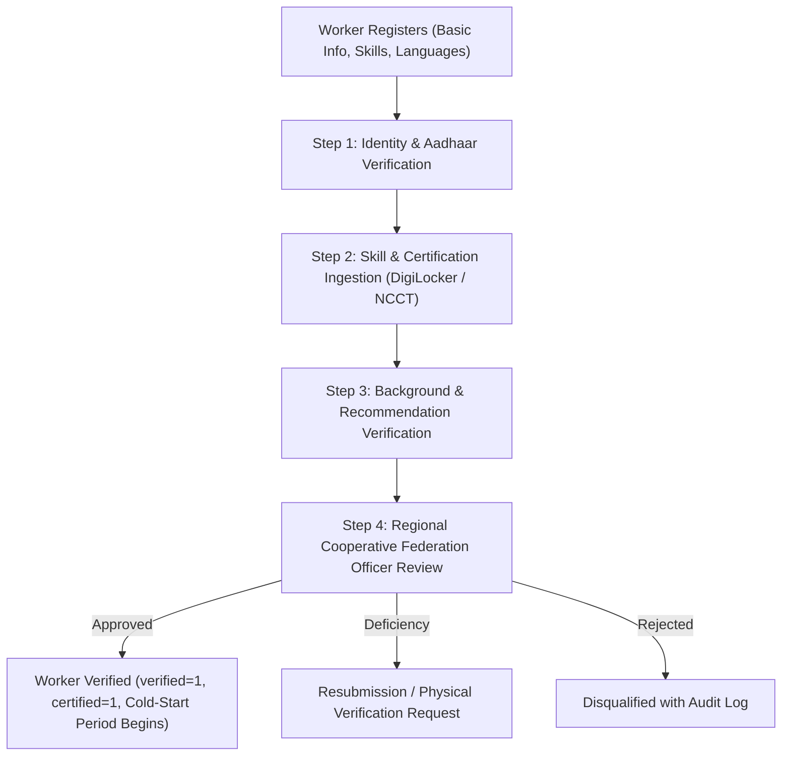
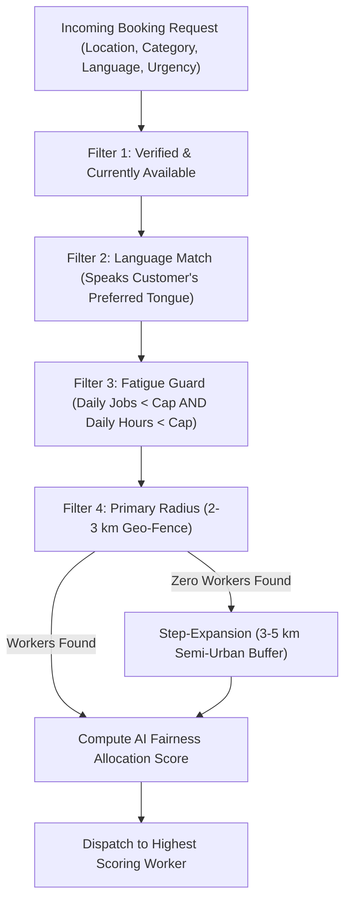
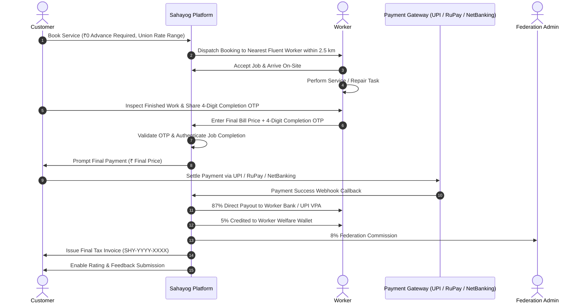
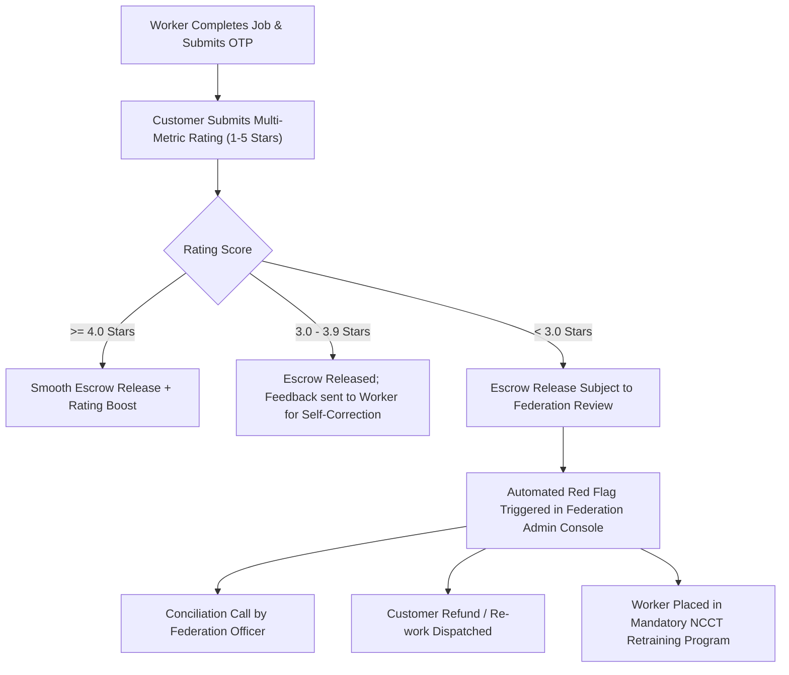
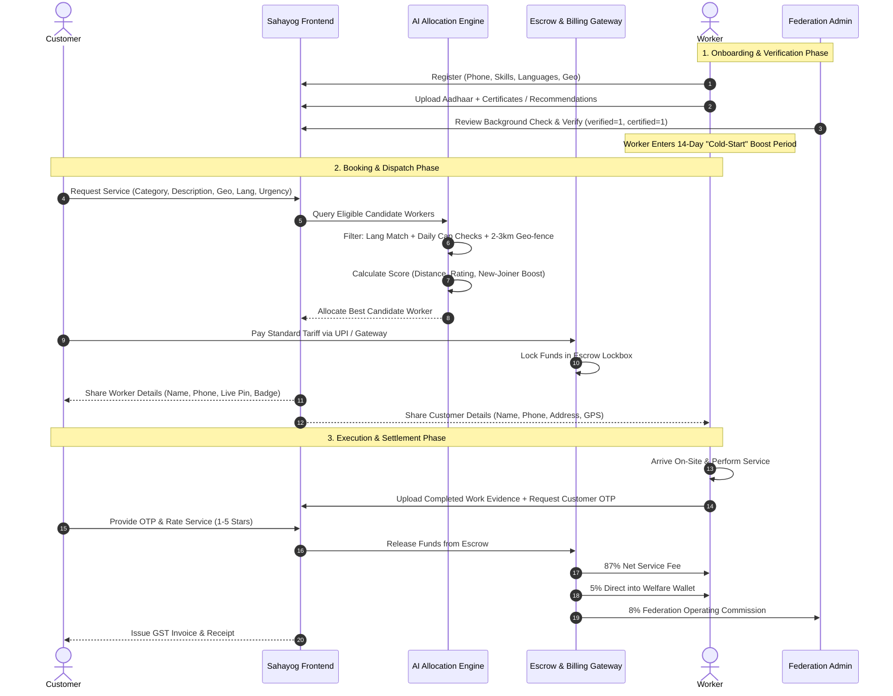

# Sahayog: Fair Worker Management & Intelligent Allocation System
## Technical Architecture, Workflow Specifications, and Regulatory Governance
> **Designed for**: Smart India Hackathon (SIH26089)  
> **Sponsoring Authority**: Ministry of Cooperation & National Council for Cooperative Training (NCCT)  
> **Platform Core**: Python (Flask) / SQLite & PostgreSQL Architecture  
> **Document Status**: Production Design Specification

---

## Table of Contents
1. [Executive Overview & Design Philosophy](#1-executive-overview--design-philosophy)
2. [Requirement-by-Requirement Technical Solution](#2-requirement-by-requirement-technical-solution)
   - [2.1 Worker Onboarding & Background Verification Engine](#21-worker-onboarding--background-verification-engine)
   - [2.2 Fair Work Allocation & AI Dispatching Engine](#22-fair-work-allocation--ai-dispatching-engine)
   - [2.3 Booking, Language-Gated Communication & Reciprocal Detail Sharing](#23-booking-language-gated-communication--reciprocal-detail-sharing)
   - [2.4 Union-Regulated Pricing, Evidence Submission & Escrow Payment Engine](#24-union-regulated-pricing-evidence-submission--escrow-payment-engine)
   - [2.5 22 Official Indian Languages & Micro-Task Expansion](#25-22-official-indian-languages--micro-task-expansion)
   - [2.6 Closed-Loop Feedback, Accountability & Retraining System](#26-closed-loop-feedback-accountability--retraining-system)
3. [End-to-End System Workflow Diagrams](#3-end-to-end-system-workflow-diagrams)
4. [Extended Database Schema & Data DDL](#4-extended-database-schema--data-ddl)
5. [AI Allocation Heuristic & Mathematical Formulation](#5-ai-allocation-heuristic--mathematical-formulation)
6. [Scalability, Government Compliance & UX Strategy](#6-scalability-government-compliance--ux-strategy)

---

## 1. Executive Overview & Design Philosophy

Existing corporate gig platforms operate as "algorithmic sweatshops." They employ black-box dispatch models that encourage extreme worker overwork (14–16 hour shifts), create superstar monopolization (top 5% workers receiving 60% of bookings), levy 20–35% predatory commissions, and lack social protections.

**Sahayog's Fair Worker Management & Allocation System** provides an institutional, cooperative alternative grounded in three fundamental pillars:
1. **Algorithmic Fairness & Human Well-being**: Hard constraints preventing worker burnout, strict geographic locality (2–3 km), and a deterministic **Cold-Start Boost** for newly registered workers.
2. **Economic Justice & Escrow Security**: Union-negotiated, government-regulated tariff cards, tamper-proof escrow settlement holding customer funds until verified completion, and an automatic **5% Welfare Contribution**.
3. **Institutional Accountability & Multilingual Inclusivity**: Integration with Aadhaar e-KYC, DigiLocker skill certificates, support for all **22 Official Eighth Schedule Indian Languages**, and automated NCCT upskilling triggers for low-rating feedback.

---

## 2. Requirement-by-Requirement Technical Solution

### 2.1 Worker Onboarding & Background Verification Engine

#### Multi-Tiered Verification Pipeline
Workers cannot receive customer bookings upon basic registration. They are gated through a 4-pillar verification pipeline:



1. **Aadhaar e-KYC / DigiLocker Identity Ingestion**:
   - Secure OTP-based Aadhaar verification via Government UIDAI / Sandbox API.
   - Encrypted retrieval of name, date of birth, photo, and address hash.
2. **Vocational & Skill Certification**:
   - Direct verification via DigiLocker API connecting to NCCT, Skill India Digital (SID), or State Skill Development Missions (SSDM).
   - For traditionally skilled uncertified workers: Authorized recommendation letters from registered local Cooperative Labour Societies or certified Master Craftsmen (Ustad / Mukhiya).
3. **Background & Police Verification**:
   - Digital verification of self-declaration affidavit against CCTNS (Crime and Criminal Tracking Network and Systems) portal where APIs are enabled.
   - Reference check with two existing verified cooperative members or local cooperative society office-bearers.
4. **Physical Inspection & Approval Audit**:
   - Regional Federation Admin reviews document hashes, verifies tools/equipment checklist, and signs off digitally.
   - Audit trail recorded in `worker_verifications` table with timestamp and admin ID.

---

### 2.2 Fair Work Allocation & AI Dispatching Engine

#### Combating Monopolization and Burnout
In standard gig platforms, top-rated veterans capture all incoming requests, while new entrants receive zero bookings and abandon the platform. Sahayog institutes mathematical fairness:



1. **Fatigue Guard (Daily Job & Hour Caps)**:
   - **Maximum Daily Jobs**: Configured per category (e.g., Electrician: 4 jobs/day; Domestic Help: 2 houses/day; Driver: 5 trips/day).
   - **Maximum Daily Active Hours**: Hard limit of 8 hours active on-site service per day. Once reached, the worker's status automatically toggles to `cooldown` until 05:00 AM next day.
2. **New Joiner "Cold-Start" Equity Boost**:
   - Newly verified workers (< 14 days on platform OR < 5 completed bookings) receive an artificial **+25% allocation score boost** ($\beta_{\text{new}} = 1.25$).
   - Guarantees new entrants establish their initial reputation without being suppressed by veterans with hundreds of reviews.
3. **Hyper-Local 2–3 km Geo-Fencing**:
   - Minimizes non-billable commute time, reducing worker fuel expenses and carbon emissions.
   - High-density urban clusters enforce a strict **2.0 km radius**. Rural and semi-urban clusters gracefully expand to **3.5 km – 5.0 km** if no local worker is active.
4. **Multi-Factor AI Scoring Heuristic**:
   Allocates based on a composite multi-objective optimization function balancing distance, capability, fairness, and new-joiner support (detailed in Section 5).

---

### 2.3 Booking, Language-Gated Communication & Reciprocal Detail Sharing

1. **Language-Gated Dispatching**:
   - Customers choose their preferred communication language (e.g., Marathi in Pune, Telugu in Hyderabad, Bengali in Kolkata).
   - The matching engine strictly filters candidate workers whose `spoken_languages` list contains the requested language.
   - Prevents miscommunications regarding complex electrical, plumbing, or caregiving instructions.
2. **Two-Way Reciprocal Detail Sharing**:
   - Once a booking status transitions to `matched`, the system instantly dispatches a synchronized notification and SMS/WhatsApp alert to both parties:
     - **To Customer**: Worker's verified name, photo badge, registered trade, federation affiliation, direct contact phone, live distance, and digital ID card.
     - **To Worker**: Customer's name, verified phone number, exact pickup/service address with GPS pin, problem description, and landmark details.
   - Eliminates blind dispatches and enables pre-service alignment.

---

### 2.4 Union-Regulated Pricing, Work Verification & Post-Service Payment Settlement



1. **Union-Regulated Rate Cards**:
   - Prevents price gouging and customer exploitation.
   - Tariff schedules are determined in consultation with District Cooperative Labour Unions and registered with the Department of Cooperation.
   - Examples:
     - *Electrician Minor Fix*: Base ₹250 (first 30 mins) + ₹150/additional 30 mins.
     - *Plumber Pipe Leakage*: Standard fix ₹300 + materials at approved cooperative MRP.
2. **Zero-Advance Pay-After-Service Model**:
   - Customers pay **zero upfront advance fees** or locked deposits, removing reservation anxiety.
   - Payment is made directly after the customer inspects completed workmanship on-site.
3. **Mutual 4-Digit OTP Verification Protocol**:
   - **Customer-Held OTP**: A private 4-digit mutual completion code is generated exclusively on the customer's dashboard upon booking.
   - **Mutual Handshake**: The worker must enter this OTP along with the final agreed bill on-site to verify completion before payment is collected.
4. **Direct Cooperative Split**:
   - Post-service UPI / digital settlement executes the transparent cooperative division:
     - **87% Direct Worker Payout**
     - **5% Worker Welfare Wallet** (health, insurance, pension)
     - **8% Federation Operating Commission**
   - Automated generation of GST-compliant PDF invoices (`SHY-YYYY-XXXX`) and instant receipts.

---

### 2.5 22 Official Indian Languages & Micro-Task Expansion

#### 1. Complete Eighth Schedule Multilingual Inclusivity
The platform natively accommodates all 22 official languages of the Republic of India:
1. Assamese (অসমীয়া)
2. Bengali (বাংলা)
3. Bodo (बड़ो)
4. Dogri (डोगरी)
5. Gujarati (ગુજરાતી)
6. Hindi (हिन्दी)
7. Kannada (ಕನ್ನಡ)
8. Kashmiri (कॉशुर)
9. Konkani (कोंकणी)
10. Maithili (मैथिली)
11. Malayalam (മലയാളം)
12. Manipuri (মৈতৈলোন্)
13. Marathi (मराठी)
14. Nepali (नेपाली)
15. Odia (ଓଡ଼ିଆ)
16. Punjabi (ਪੰਜਾਬੀ)
17. Sanskrit (संस्कृतम्)
18. Santali (संताली)
19. Sindhi (سنڌي)
20. Tamil (தமிழ்)
21. Telugu (తెలుగు)
22. Urdu (اردو)
*(Plus English as the inter-state administrative language)*

During registration, workers select all languages they speak and understand using vernacular audio-enabled chips.

#### 2. Micro-Task & Small-Scale Service Expansion
Beyond traditional technical crafts, Sahayog includes hyper-local informal micro-tasks that sustain millions of micro-entrepreneurs:
- **Daily Household Micro-Works**: Knife/scissor sharpening (*Chhuri Tez Karna*), umbrella repair, shoe mending and cobblery (*Mochi*), gas stove burner servicing, curtain and rod installation, water purifier filter swap.
- **Community & Elderly Assistance**: Assisted hospital visits for senior citizens, medicine pickup, queue assistance at civic offices, ration distribution pickup, pet walking.
- **Artisan & Village Crafts**: Micro-masonry patching, bicycle repair, traditional pottery repair, tailoring alterations.

Each micro-task has a standardized union micro-rate (e.g., ₹80–₹150) with low commission overhead.

---

### 2.6 Closed-Loop Feedback, Accountability & Retraining System



1. **Multi-Dimensional Customer Rating**:
   - Punctuality & Behavioral Conduct (1 to 5)
   - Technical Workmanship & Cleanliness (1 to 5)
   - Adherence to Union Quoted Tariff (Yes / No)
2. **Automated Escalation Matrix**:
   - **Rating $\ge$ 4.0**: Automatic positive trust score increment, instant escrow release.
   - **Average Rating Drops Below 3.5**: Worker profile temporarily paused from accepting emergency jobs.
   - **Two Consecutive Complaints**: Automated enrollment into an **NCCT Vocational Refresher Workshop** at the nearest district cooperative training center. Re-verification required after skill reassessment.

---

## 3. End-to-End System Workflow Diagrams

### Complete Customer-to-Worker Operational Journey



---

## 4. Extended Database Schema & Data DDL

To implement this architecture on top of the existing SQLite/PostgreSQL database, the following schema extensions are applied:

```sql
-- Extended Worker Attributes for Fairness & Language Matching
ALTER TABLE workers ADD COLUMN spoken_languages TEXT NOT NULL DEFAULT 'en,hi';
ALTER TABLE workers ADD COLUMN max_daily_jobs INTEGER NOT NULL DEFAULT 4;
ALTER TABLE workers ADD COLUMN daily_jobs_completed INTEGER NOT NULL DEFAULT 0;
ALTER TABLE workers ADD COLUMN active_hours_today REAL NOT NULL DEFAULT 0.0;
ALTER TABLE workers ADD COLUMN last_job_timestamp TEXT;
ALTER TABLE workers ADD COLUMN cooldown_until TEXT;
ALTER TABLE workers ADD COLUMN onboarding_completed_at TEXT;
ALTER TABLE workers ADD COLUMN aadhaar_hash TEXT;
ALTER TABLE workers ADD COLUMN police_verification_status TEXT DEFAULT 'pending';
ALTER TABLE workers ADD COLUMN recommendation_source TEXT;

-- Union Regulated Tariff & Price Cards
CREATE TABLE IF NOT EXISTS rate_cards (
    id TEXT PRIMARY KEY,
    category TEXT NOT NULL,
    service_tier TEXT NOT NULL DEFAULT 'standard', -- micro, standard, complex
    base_inspection_fee REAL NOT NULL,
    hourly_rate REAL NOT NULL,
    emergency_surcharge_pct REAL NOT NULL DEFAULT 0.20,
    union_approval_ref TEXT NOT NULL,
    effective_from TEXT NOT NULL
);

-- Escrow Transactions & Audit
CREATE TABLE IF NOT EXISTS escrow_transactions (
    id TEXT PRIMARY KEY,
    booking_id TEXT NOT NULL UNIQUE REFERENCES bookings(id),
    customer_id TEXT NOT NULL REFERENCES users(id),
    worker_id TEXT NOT NULL REFERENCES workers(id),
    amount REAL NOT NULL,
    gateway_name TEXT NOT NULL,         -- UPI, Razorpay, Cashfree, RuPay
    gateway_tx_id TEXT NOT NULL,
    status TEXT NOT NULL DEFAULT 'held',-- held, released, refunded, disputed
    held_at TEXT NOT NULL,
    released_at TEXT,
    customer_evidence_url TEXT,
    worker_completion_proof_url TEXT,
    completion_otp TEXT NOT NULL
);

-- Comprehensive 22-Language Reference Table
CREATE TABLE IF NOT EXISTS supported_languages (
    code TEXT PRIMARY KEY,
    name_english TEXT NOT NULL,
    name_native TEXT NOT NULL,
    is_eighth_schedule INTEGER NOT NULL DEFAULT 1
);

-- Worker Retraining & Grievance Logs
CREATE TABLE IF NOT EXISTS worker_retraining_logs (
    id TEXT PRIMARY KEY,
    worker_id TEXT NOT NULL REFERENCES workers(id),
    reason TEXT NOT NULL,
    ncct_center_id TEXT,
    scheduled_date TEXT,
    status TEXT NOT NULL DEFAULT 'assigned', -- assigned, in_training, cleared
    cleared_at TEXT
);
```

---

## 5. AI Allocation Heuristic & Mathematical Formulation

The matching score $S(w, c)$ for a candidate worker $w$ responding to customer booking request $c$ is determined by a transparent, multi-objective scoring formula:

$$S(w, c) = w_d \cdot F_{\text{dist}}(d) + w_r \cdot F_{\text{rating}}(r) + w_f \cdot F_{\text{fairness}}(j) + w_n \cdot B_{\text{cold-start}}$$

Where:
1. **Normalized Distance Score $F_{\text{dist}}(d)$**:
   $$F_{\text{dist}}(d) = \max\left(0, 1 - \frac{d}{R_{\text{max}}}\right)$$
   where $d = \text{Haversine}(lat_c, lng_c, lat_w, lng_w)$, and $R_{\text{max}} = 3.0\text{ km}$ (urban) or $5.0\text{ km}$ (rural).

2. **Reputation Score $F_{\text{rating}}(r)$**:
   $$F_{\text{rating}}(r) = \frac{\min(r, 5.0)}{5.0}$$
   (For brand-new workers without reviews, $r$ defaults to neutral baseline $4.0$).

3. **Fatigue & Anti-Monopoly Fairness Factor $F_{\text{fairness}}(j)$**:
   Penalizes workers who have already received multiple jobs today, pushing opportunities toward under-utilized workers:
   $$F_{\text{fairness}}(j) = 1 - \frac{\text{JobsCompletedToday}(w)}{\text{MaxDailyJobs}(w)}$$

4. **New-Joiner "Cold-Start" Equity Boost $B_{\text{cold-start}}$**:
   $$B_{\text{cold-start}} = \begin{cases} 
   1.0 & \text{if } (\text{DaysOnPlatform} \le 14 \text{ OR } \text{TotalBookings} \le 5) \\
   0.0 & \text{otherwise}
   \end{cases}$$

5. **Weight Coefficients**:
   - Distance Proximity ($w_d$): $0.35$
   - Fairness & Load-Balancing ($w_f$): $0.30$
   - New-Joiner Boost ($w_n$): $0.20$
   - Past Rating ($w_r$): $0.15$

$$\sum w = 0.35 + 0.30 + 0.20 + 0.15 = 1.00$$

*Hard Disqualification*: If $\text{LanguageMatch}(w, c) = \text{False}$ OR $\text{JobsCompletedToday}(w) \ge \text{MaxDailyJobs}$, then $S(w, c) = -\infty$.

---

## 6. Scalability, Government Compliance & UX Strategy

### 6.1 Regulatory Compliance
- **Digital Personal Data Protection (DPDP) Act, 2023**:
  - Customer phone numbers and addresses are masked; unmasked access is granted only during active booking windows.
  - Aadhaar numbers are never stored in plain text; only UIDAI-verified virtual token hashes are retained.
- **Code on Social Security, 2020**:
  - Direct institutional fulfillment of Chapter IX (Social Security for Gig and Platform Workers) via the **5% Welfare Wallet** and cooperative registry.
- **Cooperative Societies Acts (Multi-State & State)**:
  - Preserves federation autonomy by placing administrative desks in the hands of registered district cooperative unions.

### 6.2 Scalability across Rural, Semi-Urban & Urban India
- **Low-Bandwidth & Offline Capabilities**:
  - Server-rendered HTML templates load under 1.5 seconds even on 2G/3G networks in rural hinterlands.
  - Interactive Voice Response (IVR) and SMS dispatch integration for non-smartphone gig workers.
- **Micro-Hub Logistics**:
  - Rural cooperative *Panchayat* centers serve as physical onboarding and tool-rental hubs.

### 6.3 User Experience (UX) Enhancements
- **Vernacular Audio Prompts**: One-tap audio read-out of job details in the worker's selected native tongue.
- **One-Click SOS Emergency Button**: Integrated safety trigger dispatching alerts to local police and the cooperative federation desk.
- **Transparent Wallet Passbook**: Real-time visualization of direct earnings vs. welfare savings, fostering high trust in cooperative administration.
