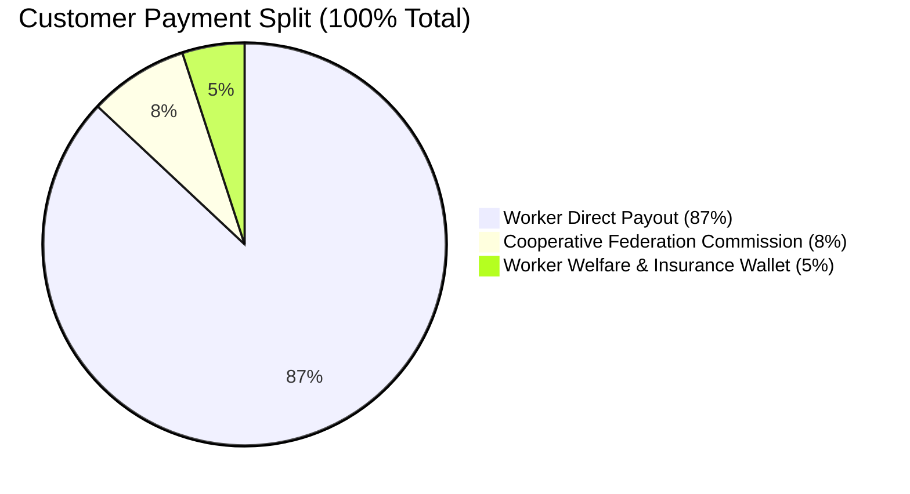
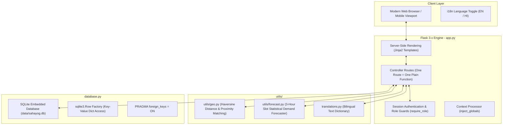
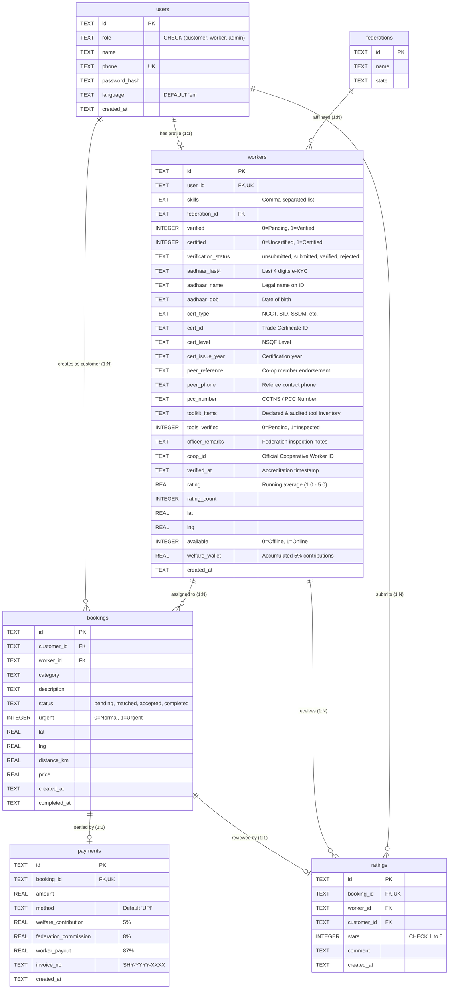

# Sahayog (Python Edition) — Comprehensive Project Specification & Documentation

> **Problem Statement ID**: SIH26089  
> **Challenge**: Cooperative Gig Services Platform for Household & Community Services  
> **Stakeholders**: Ministry of Cooperation / National Council for Cooperative Training (NCCT), Government of India  
> **Repository**: `sahayog-python`  
> **Status**: Working Hackathon Prototype & Demonstration System  
> **Last Updated**: September 2026

---

## 1. Executive Summary & Vision

**Sahayog** (सहयोग) is a cooperative-owned digital platform engineered to empower gig and informal service workers across India. Built as an architectural alternative to extractive commercial aggregators (e.g., Urban Company, TaskRabbit, Uber), Sahayog aligns digital gig employment with cooperative principles governed under the Ministry of Cooperation and the National Council for Cooperative Training (NCCT).

### The Core Problem
Commercial platform aggregators typically impose steep commission cuts (ranging between 20% to 35%), offer zero institutional social security, and treat informal gig workers as expendable independent contractors. Workers bear full operational and health risks without receiving pension benefits, health insurance, or collective ownership.

### The Sahayog Solution
Sahayog shifts platform ownership from private venture capital to **Cooperative Labour Federations**:
1. **Low, Transparent Platform Commission**: A modest **8%** federation commission (compared to 20–35% on corporate platforms) retained strictly for federation operational overhead, dispute handling, and infrastructure upkeep.
2. **Automated Worker Welfare & Social Security**: Every completed customer payment automatically directs **5%** into an individual worker **Welfare Wallet** (`welfare_wallet`), accumulating capital for health insurance, emergency micro-credit, and pension schemes.
3. **Cooperative Payout**: The worker takes home **87%** of the direct service charge immediately upon completion.
4. **Institutional Verification & Skill Certification**: Workers are accredited directly through cooperative federations and vocational centers (Aadhaar e-KYC and NCCT skill certifications).
5. **Ethical AI & Open Dispatching**: Transparent, proximity-based geo-matching using the Haversine formula and statistical demand forecasting for cooperative workforce planning.

---

## 2. Cooperative Economic Model & Financial Split

The economic flow of every rupee transacted through Sahayog is dictated by hardcoded, federation-tunable constants in `app.py`:

```python
FEDERATION_COMMISSION_PCT = 0.08   # 8% retained by cooperative federation
WELFARE_CONTRIBUTION_PCT  = 0.05   # 5% auto-credited to worker welfare wallet
```

### Financial Split Breakdown

| Flow Component | Percentage | Destination / Purpose |
|---|---|---|
| **Direct Worker Payout** | **87.0%** | Deposited directly to worker upon job completion. |
| **Federation Commission** | **8.0%** | Retained by the regional cooperative federation for platform operations, administrative mediation, and regional office support. |
| **Worker Welfare Wallet** | **5.0%** | Automatically credited to the worker's personal welfare fund (`workers.welfare_wallet`) for emergency funds, medical coverage, and collective insurance. |



### Example Transaction: ₹1,000 Service Fee
- **Gross Service Fee**: ₹1,000.00
- **Worker Direct Payout**: ₹870.00
- **Federation Operations**: ₹80.00
- **Worker Welfare Contribution**: ₹50.00
- **Invoice Issued**: `SHY-2026-1001` with cryptographic reference in the SQLite ledger.

---

## 3. High-Level System Architecture

Sahayog Python Edition is designed with an uncompromising philosophy: **Zero-magic, ultra-readable, standard-library-first full-stack architecture**.



### Architectural Decisions & Rationale
1. **Python 3.8+ & Flask 3.x**: Lightweight, minimal overhead, easily maintainable by non-profit cooperatives and government IT departments.
2. **Plain SQL over Heavy ORMs**: No SQLAlchemy or complex migrations. `database.py` executes direct, transparent SQL statements (`SELECT`, `INSERT`, `UPDATE`). Developers and evaluators can inspect queries without digging through ORM abstraction layers.
3. **Single File Database (`data/sahayog.db`)**: Employs SQLite with `sqlite3.Row` and foreign key enforcement (`PRAGMA foreign_keys = ON`). Zero installation and zero configuration needed.
4. **Server-Side Rendered (SSR) Jinja2**: Eliminates npm build pipelines, Webpack/Vite bundlers, client-side state managers, and JWT handshake complexity. Forms POST directly to endpoints and refresh cleanly.
5. **Vanilla CSS Design System (`static/css/style.css`)**: Implements custom CSS variables, accessible typography (`Fraunces` and `IBM Plex Sans`), card containers, responsive CSS grids, and interactive tab switches without external CSS frameworks like Tailwind or Bootstrap.

---

## 4. Repository Directory & File Structure

```
sahayog-python/
├── app.py                      # Core Flask controller; all routes, sessions, & business logic
├── database.py                 # SQLite database schema, connection manager, & category constants
├── seed.py                     # Demo data population script (Federations, Workers, Bookings, Customers)
├── translations.py             # English & Hindi translation dictionaries and lookup helper
├── requirements.txt           # Python package dependencies (Flask>=3.0.0)
├── PROJECT_DESCRIPTION.md     # Single source of truth project specification (this document)
├── README.md                  # Quick-start instructions and project pitch overview
├── utils/                      # Modular domain helper utilities
│   ├── geo.py                 # Haversine distance calculator & nearest-worker matching algorithm
│   └── forecast.py            # Time-slot booking aggregator & AI demand forecasting model
├── templates/                  # Server-rendered Jinja2 HTML templates
│   ├── base.html              # Base layout with navigation, language toggle, & flash alerts
│   ├── index.html             # Public landing page, stats hero, & login/register tabbed interface
│   ├── customer_dashboard.html# Service booking form, geolocation input, & booking history
│   ├── worker_dashboard.html  # Worker job queue, accept/complete actions, & welfare wallet balance
│   └── admin_dashboard.html   # Federation stats, verification queue, forecast table, & worker directory
├── static/
│   └── css/
│       └── style.css          # Custom responsive CSS design system and typography tokens
└── data/
    └── sahayog.db             # Generated SQLite database file containing all live records
```

---

## 5. Database Architecture & Data Dictionary

All tables are defined in `database.py` with strict relational constraints and foreign key linkages.



### Table 1: `users`
Stores user identities across all three system personas.
- `id` (TEXT, PK): 32-character hexadecimal UUID (`uuid.uuid4().hex`).
- `role` (TEXT, NOT NULL): Constrained by `CHECK(role IN ('customer', 'worker', 'admin'))`.
- `name` (TEXT, NOT NULL): Full legal name of user or federation administrator.
- `phone` (TEXT, NOT NULL, UNIQUE): 10-digit mobile number used as the login credential.
- `password_hash` (TEXT, NOT NULL): Secure hash generated via `werkzeug.security.generate_password_hash`.
- `language` (TEXT, NOT NULL, DEFAULT `'en'`): User's preferred locale (`en` or `hi`).
- `created_at` (TEXT, NOT NULL): ISO-8601 formatted timestamp (`YYYY-MM-DDTHH:MM:SS.mmmmmm`).

### Table 2: `federations`
Represents regional labour cooperative societies registered under national/state cooperative laws.
- `id` (TEXT, PK): Unique federation UUID.
- `name` (TEXT, NOT NULL): Name of the registered society (e.g., "Hyderabad Labour Cooperative Federation").
- `state` (TEXT): Operating state/union territory.

### Table 3: `workers`
Contains operational, skill, accreditation, and financial ledger data for cooperative service providers.
- `id` (TEXT, PK): Unique worker profile UUID.
- `user_id` (TEXT, NOT NULL, UNIQUE, FK -> `users(id)`): One-to-one link to user credentials.
- `skills` (TEXT, NOT NULL): Comma-delimited list of skill tags (e.g., `"electrician,technician"`).
- `federation_id` (TEXT, FK -> `federations(id)`): The supervising cooperative union.
- `verified` (INTEGER, NOT NULL, DEFAULT 0): Identity verification gate (0 = Pending Aadhaar/e-KYC review; 1 = Verified).
- `certified` (INTEGER, NOT NULL, DEFAULT 0): Technical skill certification gate.
- `verification_status` (TEXT, NOT NULL, DEFAULT `'unsubmitted'`): Lifecycle accreditation state (`'unsubmitted'`, `'submitted'`, `'verified'`, `'rejected'`).
- `aadhaar_last4` (TEXT): Last 4 digits of Aadhaar card for UIDAI e-KYC validation.
- `aadhaar_name` (TEXT): Full legal name as validated via UIDAI records.
- `aadhaar_dob` (TEXT): Date of birth for age & identity validation.
- `cert_type` (TEXT): Trade accreditation body (NCCT Master Craftsman, Skill India Digital, State Labour Board SSDM, Guild Recommendation).
- `cert_id` (TEXT): Official certificate registration number or guild credential ID.
- `cert_level` (TEXT): National Skill Qualification Framework (NSQF) level (e.g. `NSQF Level 4 - Master Craftsman`).
- `cert_issue_year` (TEXT): Year of vocational certification issuance.
- `peer_reference` (TEXT): Endorsement name and membership ID of a senior cooperative guild member or Mukhiya.
- `peer_phone` (TEXT): Mobile number of cooperative referee for telephonic endorsement check.
- `pcc_number` (TEXT): Police Clearance Certificate (PCC) or CCTNS reference identifier.
- `toolkit_items` (TEXT): Itemized equipment checklist declared and physically inspected by the Federation Officer.
- `tools_verified` (INTEGER, NOT NULL, DEFAULT 0): Field officer audit confirmation of physical toolkit and safety gear.
- `officer_remarks` (TEXT): Formal field inspection notes and endorsement remarks logged by the Federation Administrator.
- `coop_id` (TEXT): Unique Cooperative Worker Identity Code (e.g., `SHY-COOP-HYD-04819`).
- `verified_at` (TEXT): Timestamp when 4-pillar accreditation was officially granted.
- `rating` (REAL, NOT NULL, DEFAULT 0): Cumulative rolling arithmetic mean rating (1.0 to 5.0).
- `rating_count` (INTEGER, NOT NULL, DEFAULT 0): Total completed ratings received.
- `lat` (REAL), `lng` (REAL): Geolocation coordinates representing the worker's home/dispatch base.
- `available` (INTEGER, NOT NULL, DEFAULT 1): Real-time availability toggle (1 = Online, 0 = Offline).
- `welfare_wallet` (REAL, NOT NULL, DEFAULT 0): Accumulated social security balance in Indian Rupees (₹).
- `spoken_languages` (TEXT, NOT NULL, DEFAULT 'en,hi'): Comma-separated regional language codes (e.g., 'en,hi,te') used for strict customer-worker language matching.
- `created_at` (TEXT, NOT NULL): Registration timestamp.

### Table 4: `bookings`
Tracks the full lifecycle of a service request from initiation to completion.
- `id` (TEXT, PK): Unique booking UUID.
- `customer_id` (TEXT, NOT NULL, FK -> `users(id)`): The requesting customer.
- `worker_id` (TEXT, FK -> `workers(id)`): The assigned worker (NULL if placed in pending queue).
- `category` (TEXT, NOT NULL): One of the 10 NCCT standardized categories.
- `description` (TEXT): Customer-provided problem description.
- `status` (TEXT, NOT NULL, DEFAULT `'pending'`): Lifecycle stages: `'pending'` -> `'matched'` -> `'accepted'` -> `'completed'`.
- `urgent` (INTEGER, NOT NULL, DEFAULT 0): Priority toggle (1 = Emergency on-demand booking).
- `lat` (REAL), `lng` (REAL): Coordinates where service is requested.
- `distance_km` (REAL): Calculated Haversine distance between customer and matched worker.
- `price` (REAL): Final service charge entered by the worker upon job completion.
- `completion_otp` (TEXT): 4-digit mutual completion authentication code for milestone escrow release.
- `escrow_status` (TEXT, NOT NULL, DEFAULT 'held'): Escrow state ('held' or 'released').
- `language` (TEXT, NOT NULL, DEFAULT 'en'): Customer's selected communication language for the booking.
- `created_at` (TEXT, NOT NULL): Request submission timestamp.
- `completed_at` (TEXT): Timestamp when marked completed by worker.

### Table 5: `payments`
Immutable financial record of digital payment settlements and cooperative deductions.
- `id` (TEXT, PK): Unique payment settlement UUID.
- `booking_id` (TEXT, NOT NULL, UNIQUE, FK -> `bookings(id)`): Target booking.
- `amount` (REAL, NOT NULL): Gross billed price in ₹.
- `method` (TEXT, NOT NULL, DEFAULT `'UPI'`): Payment rail (e.g., UPI, RuPay).
- `welfare_contribution` (REAL, NOT NULL): 5% deduction added to worker's wallet.
- `federation_commission` (REAL, NOT NULL): 8% deduction credited to the cooperative.
- `worker_payout` (REAL, NOT NULL): 87% net payout to worker.
- `invoice_no` (TEXT, NOT NULL): Structured invoice identifier (e.g., `SHY-2026-1007`).
- `created_at` (TEXT, NOT NULL): Settlement timestamp.

### Table 6: `ratings`
Customer feedback and rating records.
- `id` (TEXT, PK): Rating record UUID.
- `booking_id` (TEXT, NOT NULL, UNIQUE, FK -> `bookings(id)`): Associated booking.
- `worker_id` (TEXT, NOT NULL, FK -> `workers(id)`): Rated worker.
- `customer_id` (TEXT, NOT NULL, FK -> `users(id)`): Reviewer.
- `stars` (INTEGER, NOT NULL): Constrained by `CHECK(stars BETWEEN 1 AND 5)`.
- `comment` (TEXT): Optional customer feedback text.
- `created_at` (TEXT, NOT NULL): Review submission timestamp.

---

## 6. The 10 NCCT Service Categories

In accordance with SIH26089 and the National Council for Cooperative Training guidelines, 10 primary categories are supported:

| Key (`category_id`) | Display Label (English) | Display Label (Hindi) |
|---|---|---|
| `electrician` | Electrician | इलेक्ट्रीशियन |
| `plumber` | Plumber | प्लंबर |
| `carpenter` | Carpenter | बढ़ई (कारपेंटर) |
| `painter` | Painter | पेंटर |
| `domestic_help` | Domestic Help | घरेलू सहायक |
| `caregiver` | Caregiver | देखभालकर्ता (केयरगिवर) |
| `driver` | Driver | चालक (ड्राइवर) |
| `gardener` | Gardener | माली |
| `cleaner` | Cleaner | सफाईकर्मी |
| `technician` | Technician | तकनीशियन |

---

## 7. User Roles & Permission Workflows

The application enforces three distinct personas using the `require_role(role)` decorator guard:

### 1. Customer Persona (`role = 'customer'`)
- **Landing & Registration**: Selects "I need a service" (`role_customer`), inputs name, phone, password, preferred language.
- **Service Booking**: Selects service category, enters problem description, provides GPS coordinates (or test coordinates), toggles "Urgent" if emergency.
- **Worker Matching**: Immediately matched with nearest verified, available worker or placed in `pending` queue.
- **Settlement & Payment**: Once worker marks the job `completed`, clicks "Pay now" to trigger UPI invoice creation, 8% federation split, and 5% welfare credit.
- **Review**: Submits 1-to-5 star rating with qualitative feedback.

### 2. Worker Persona (`role = 'worker'`)
- **Onboarding**: Selects "I provide a service" (`role_worker`), specifies skills via multi-select chips. Account is created with `verified = 0` (unverified).
- **Accreditation Gate**: A banner notifies the worker that verification is pending. The worker cannot receive job dispatches until an administrator verifies them.
- **Availability Management**: Toggles real-time availability on/off (`worker_availability`).
- **Job Lifecycle**:
  - **Matched**: Worker views customer description, coordinates, and distance, then clicks "Accept".
  - **Accepted**: Worker arrives on-site, executes service, enters final price in ₹, and clicks "Mark completed".
- **Financial Visibility**: Displays live star rating (`rating`), total reviews (`rating_count`), and cumulative Welfare Wallet balance (`welfare_wallet`).

### 3. Federation Admin Persona (`role = 'admin'`)
- **Operational Oversight**: High-level telemetry displaying:
  - Verified workers vs. total registered workers
  - Total customer accounts
  - Booking completion rate (%)
  - Gross platform GMV (Gross Merchandise Value)
  - Cumulative federation commission revenue (8%)
  - Cumulative worker welfare fund generated (5%)
- **Verification Desk**: Approves unverified workers (`admin_verify`) after physical or digital e-KYC validation.
- **Category Volume Breakdown**: Real-time aggregation of booking demand by trade.
- **Workforce Allocation Forecaster**: View expected demand per 3-hour daily time slots and automated staffing recommendations.
- **Master Worker Directory**: Complete roster of all workers with live status, rating, and wallet balance.

---

## 8. Core Algorithms & Domain Logic

### 8.1 Geo-Location Matching Algorithm (`utils/geo.py`)
Sahayog implements the **Haversine Formula** to compute the great-circle distance between two sets of GPS coordinates on the Earth's surface ($R = 6,371\text{ km}$):

$$\Delta\phi = \phi_2 - \phi_1,\quad \Delta\lambda = \lambda_2 - \lambda_1$$
$$a = \sin^2\left(\frac{\Delta\phi}{2}\right) + \cos(\phi_1)\cos(\phi_2)\sin^2\left(\frac{\Delta\lambda}{2}\right)$$
$$c = 2 \cdot \operatorname{atan2}\left(\sqrt{a}, \sqrt{1 - a}\right)$$
$$d = R \cdot c$$

#### Matching Heuristic (`find_best_worker`)
When a customer submits a booking:
1. **Hard Eligibility Filters**:
   - Worker must be verified (`verified == 1`).
   - Worker must be online (`available == 1`).
   - Requested category must exist in worker's comma-separated skill set (`category in skills.split(',')`).
2. **Scoring & Prioritization**:
   - Candidates within a **15 km operational radius** receive top priority (`d <= 15`).
   - **Distance Binning (0.5 km steps)**: Workers within 500 meters of each other are grouped into the same distance bin (`round(d / 0.5)`).
   - **Rating Tiebreaker**: Within the same distance bin, the worker with the **higher star rating** (`-worker["rating"]`) wins the dispatch.
   - If no candidate qualifies, the booking falls back to `status = 'pending'`.

### 8.2 Demand Forecasting & Workforce Allocation (`utils/forecast.py`)
To prevent gig worker undersupply during peak hours and oversupply during lulls, Sahayog features an interpretable statistical forecasting model:
1. **Time-Slot Binning**: Historical bookings are partitioned into eight 3-hour diurnal slots (`00:00-03:00`, `03:00-06:00`, ..., `21:00-24:00`).
2. **Frequency Aggregation**: Counts total observed requests per `(category, slot)`.
3. **Growth Projection**: Projects future expected demand with an empirical 10% safety buffer:
   $$\text{Expected Demand} = \operatorname{round}(\text{Observed Count} \times 1.1, 1)$$
4. **Staffing Recommendation**: Recommends staffing levels assuming an average of 2 jobs per worker per 3-hour window:
   $$\text{Recommended Workers} = \max\left(1, \left\lceil \frac{\text{Expected Demand}}{2} \right\rceil\right)$$
5. **Output**: Sorted by expected demand descending, directly powering the administrative forecasting table.

### 8.3 Rolling Rating Calculation (`app.py:customer_rate`)
Worker ratings are calculated in $O(1)$ without scanning the historical ratings table:
$$\text{New Count} = \text{Count}_{\text{old}} + 1$$
$$\text{New Average} = \operatorname{round}\left(\frac{\text{Rating}_{\text{old}} \times \text{Count}_{\text{old}} + \text{Stars}_{\text{new}}}{\text{New Count}}, 2\right)$$

---

## 9. HTTP Endpoints & Route Reference

| Method | Endpoint | Allowed Role | Key Parameters | Function Description |
|---|---|---|---|---|
| `GET` | `/` | Public | None | Landing page, platform metrics, login/register tabs. Redirects authenticated users to their respective dashboard. |
| `POST` | `/register` | Public | `name`, `phone`, `password`, `role`, `language`, `skills` | Registers a new customer or worker. Workers are initialized unverified (`verified=0`). |
| `POST` | `/login` | Public | `phone`, `password` | Authenticates user via PBKDF2 hash check; populates session cookie. |
| `GET` | `/logout` | Authenticated | None | Destroys active Flask session; redirects to `/`. |
| `GET` | `/lang/<code>` | Public | `code` (`'en'` or `'hi'`) | Updates language in session; redirects back to referring page. |
| `GET` | `/customer` | Customer | None | Renders customer dashboard, booking form, and active/past bookings. |
| `POST` | `/customer/book` | Customer | `category`, `description`, `lat`, `lng`, `urgent` | Dispatches nearest verified worker via Haversine heuristic or queues as pending. |
| `POST` | `/customer/pay/<id>` | Customer | Route parameter `booking_id` | Executes financial split (87/8/5), generates invoice, credits worker wallet. |
| `POST` | `/customer/rate/<id>`| Customer | `stars`, `comment` | Persists review, updates worker's cumulative running average. |
| `GET` | `/customer/settings` | Customer | None | Renders customer profile & account settings, security controls, and cooperative membership stats. |
| `POST` | `/customer/settings/profile` | Customer | `name`, `phone`, `language`, `address` | Updates customer contact profile, saved service address, and default language. |
| `POST` | `/customer/settings/password` | Customer | `current_password`, `new_password`, `confirm_password` | Verifies current password and updates PBKDF2 hash. |
| `GET` | `/worker` | Worker | None | Displays worker stats, welfare wallet, availability toggle, and assigned jobs. |
| `GET` | `/worker/verification` | Worker | None | Dedicated 4-Pillar Cooperative Craftsman Verification Portal with UIDAI e-KYC, NCCT credentials, and Smart Digital ID Card. |
| `POST` | `/worker/verification/save` | Worker | Comprehensive 4-pillar fields | Saves complete detailed 4-pillar verification and triggers field audit. |
| `POST` | `/worker/availability`| Worker | `available` (checkbox) | Updates worker's online/offline dispatch status. |
| `POST` | `/worker/verify/submit`| Worker | `aadhaar_last4`, `cert_type`, `cert_id`, `peer_reference`, `police_declaration`, `tools_verified` | Quick-submits 4-Pillar credentials from dashboard widget. |
| `POST` | `/worker/accept/<id>` | Worker | Route parameter `booking_id` | Accepts matched booking; transitions status to `accepted`. |
| `POST` | `/worker/complete/<id>`| Worker | `price` | Records final charge; transitions status to `completed`. |
| `GET` | `/admin` | Admin | None | Federation management console: KPIs, 4-pillar verification desk, demand forecast. |
| `GET` | `/admin/verify/worker/<id>` | Admin | Route parameter `worker_id` | Dedicated Federation Field Officer Verification inspection view. |
| `POST` | `/admin/verify/worker/<id>/approve` | Admin | `officer_remarks` | Approves all 4 pillars, records officer endorsement, and issues Cooperative Passport. |
| `POST` | `/admin/verify/worker/<id>/reject` | Admin | `officer_remarks` | Flags deficiencies and requests candidate correction/re-inspection. |
| `POST` | `/admin/verify/<id>` | Admin | Route parameter `worker_id` | Quick-approves 4 pillars and activates cold-start boost. |

---

## 10. Localization & Internationalization (i18n)

Multilingual accessibility is vital for blue-collar gig workers and local households across India:
- **Architecture**: `translations.py` exports a comprehensive dictionary (`TRANSLATIONS`) supporting English (`en`) and Hindi (`hi`).
- **Template Integration**: The custom Jinja2 global context processor injects the helper `t(key)`, resolving translations dynamically based on `session.get('lang', 'en')`:
  ```python
  @app.context_processor
  def inject_globals():
      lang = session.get("lang", "en")
      return {
          "current_user": current_user(),
          "lang": lang,
          "categories": SERVICE_CATEGORIES,
          "t": lambda key: translate(key, lang),
      }
  ```
- **Language Switcher**: Dedicated header pills (`EN` / `हिं`) invoke `/lang/en` or `/lang/hi`, saving user preference in the session.

---

## 11. Design System & Frontend Specifications

The UI is built on a custom design system defined in `static/css/style.css`:

### Color Palette Tokens
- **Background (`--color-bg`)**: `#FBF8F3` (Warm eggshell/parchment)
- **Card Surfaces (`--color-surface`)**: `#FFFFFF` (Pure white)
- **Primary Ink (`--color-ink`)**: `#17241D` (Deep forest ink)
- **Primary Brand (`--color-primary`)**: `#1B4332` (Cooperative emerald green)
- **Primary Dark (`--color-primary-dark`)**: `#102A20` (Deep header green)
- **Accent Brand (`--color-accent`)**: `#E08D14` (Cooperative marigold/gold)
- **Border Tone (`--color-border`)**: `#E4DCC9` (Warm linen border)
- **Status Success (`--color-success`)**: `#2D6A4F` / Soft `#E7F1EB`
- **Status Danger (`--color-danger`)**: `#B3261E` / Soft `#FBEAE9`

### Typography
- **Headings & Display**: `'Fraunces'`, Georgia, serif (high-credibility editorial aesthetic).
- **Body & Controls**: `'IBM Plex Sans'`, `'IBM Plex Sans Devanagari'`, sans-serif (crisp legibility across English and Hindi).

---

## 12. Local Environment Setup & Demonstration Guide

### Prerequisites
- Python 3.8 or higher installed on host machine.
- Pip package manager.

### Step-by-Step Installation

```bash
# 1. Navigate to project root
cd sahayog-python

# 2. (Optional) Activate existing virtual environment
# On Windows:
.venv\Scripts\activate
# On Linux/macOS:
source .venv/bin/activate

# 3. Install dependencies (Flask only)
pip install -r requirements.txt

# 4. Seed database with realistic demo accounts & historical data
python seed.py

# 5. Launch the local Flask server
python app.py
```

Open your browser at **`http://localhost:5000`**.

### Pre-Seeded Demonstration Accounts

| Role | Phone | Password | Name | Testing Notes |
|---|---|---|---|---|
| **Federation Admin** | `9000000000` | `admin123` | Federation Admin | Accesses `/admin`, reviews revenue, verifies workers, reviews forecasts. |
| **Verified Worker** | `9111111111` | `worker123` | Ramesh Kumar | Electrician & Technician in Hyderabad (`17.44, 78.39`). Rating: 4.7. |
| **Unverified Worker** | `9111111115` | `worker123` | Mahesh Yadav | Carpenter & Painter. Cannot receive bookings until verified in Admin console. |
| **Customer** | `9333333331` | `customer123` | Priya Sharma | Bookings matched to Ramesh when booking around Hyderabad (`17.44, 78.40`). |
| **Customer (Hindi)** | `9333333332` | `customer123` | Arjun Mehta | Demonstrates default Hindi locale preference. |

*Demo Geolocation Coordinates*:
- **Hyderabad Cluster**: Latitude `17.44` to `17.45`, Longitude `78.38` to `78.40` (Matches Ramesh Kumar, Suresh Naik, Lakshmi Devi, Anita Reddy).
- **Pune Cluster**: Latitude `18.52` to `18.57`, Longitude `73.85` to `73.91` (Matches Sanjay Pawar, Vijay Shinde).

---

## 13. Production Roadmap & Engineering Enhancements

While this codebase is intentionally optimized for readability and demonstration, the transition to high-throughput enterprise scale involves five standard steps:

1. **Database Tier (PostgreSQL)**:
   - Replace `sqlite3` in `database.py` with `psycopg3` or `asyncpg`.
   - The plain SQL statements require virtually no changes, preserving foreign key integrity and transaction isolation.
2. **Real Payment Gateway Integration**:
   - Replace mock completion in `customer_pay()` with Razorpay Route / Cashfree Split Settlement API.
   - Automatically route the 87% / 8% / 5% split directly to the worker's bank account, federation escrow account, and welfare trust fund via automated webhooks.
3. **National Identity & Skill Verification Integration**:
   - Integrate DigiLocker API and Aadhaar e-KYC for instant paperless worker identity verification.
   - Connect with National Council for Cooperative Training (NCCT) and Skill India Digital APIs to automatically ingest accredited vocational diplomas.
4. **Production WSGI/ASGI Server**:
   - Run Flask behind Gunicorn or uWSGI behind an Nginx reverse proxy with SSL termination:
     ```bash
     gunicorn -w 4 -b 0.0.0.0:5000 app:app
     ```
5. **Advanced Machine Learning Demand Forecasting**:
   - Upgrade `utils/forecast.py` from statistical slot aggregation to a Facebook Prophet or LSTM neural time-series model incorporating seasonal weather patterns, local festivals, and holidays.

---

---

## 14. Fair Worker Management, Allocation & Escrow System Specification

To eliminate algorithmic exploitation and ensure complete transparency, Sahayog incorporates an advanced cooperative worker management and allocation engine (detailed in [FAIR_WORKER_ALLOCATION_SYSTEM.md](FAIR_WORKER_ALLOCATION_SYSTEM.md)):

### 1. Multi-Tier Worker Onboarding & Background Check
- **Four-Pillar Gate**: (1) Aadhaar e-KYC validation, (2) DigiLocker integration for NCCT and Skill India accredited certificates or authorized recommendations from registered cooperative master craftsmen, (3) digital criminal record self-declaration check, and (4) physical tool & identity verification sign-off by a Federation Officer.
- **Accreditation Lock**: Workers remain in `verified = 0` and cannot receive job alerts until formal approval is logged in the audit ledger.

### 2. Fair Work Allocation & AI Dispatching Engine
- **Fatigue Guard (Anti-Burnout)**: Hard cap of 4 jobs/day or 8 active on-site service hours to prevent worker exhaustion.
- **New-Joiner "Cold-Start" Equity Boost**: Newly registered workers (< 14 days or < 5 jobs) receive an automatic +25% scoring boost to build their initial reputation and ratings.
- **Hyper-Local 2–3 km Geo-Fencing**: Confines dispatches to a strict 2–3 km radius (expanding to 5 km in rural areas if needed), reducing unpaid commute time and fuel expenses.
- **Multi-Objective AI Scoring**: Transparent formula balancing proximity (35%), load-balancing fairness (30%), new-joiner boost (20%), and past ratings (15%).

### 3. Language-Gated Communication & Detail Sharing
- **Linguistic Precision**: Customer selects communication language; only workers fluent in that language are matched.
- **Reciprocal Credentials**: Upon booking match, synchronized credentials (name, phone, GPS pin, federation badge) are shared simultaneously with both customer and worker.

### 4. Union-Regulated Pricing & Post-Work Settlement Engine (Zero Upfront Escrow)
- **Zero Advance Required (Pay-After-Service)**: Eliminates customer friction and upfront fund lock-in. Customers pay only after inspecting completed workmanship on-site.
- **Cooperative Rate Cards**: Transparent tariffs determined in consultation with District Labour Unions (₹250 base inspection + ₹150/hr ceiling); zero arbitrary surge pricing.
- **Mutual 4-Digit OTP Completion Authentication**: Work completion is verified on-site using a customer-held 4-digit OTP to authenticate job delivery before payment is billed.
- **Direct Cooperative Split**: Upon post-work payment via UPI, funds are automatically distributed: 87% Direct Worker Payout, 5% Worker Welfare Fund (health/insurance/pension), and 8% Federation Operations.

### 5. 22 Official Languages & Micro-Task Expansion
- **Constitutional Linguistic Inclusivity**: Covers all 22 Eighth Schedule Indian languages natively with vernacular audio read-outs.
- **Micro-Task Livelihoods**: Standardized micro-tariffs (₹80–₹180) for informal street crafts: knife sharpening, shoe repair (*Mochi*), umbrella mending, gas stove repair, and elderly assistance.

### 6. Closed-Loop Feedback & NCCT Retraining
- **Humane Accountability**: Replaces punitive private bans with rehabilitation. If a worker's rating drops below 3.5 stars, they are automatically enrolled in a 2-day upskilling workshop at the nearest National Council for Cooperative Training (NCCT) center.

---

## 15. Document Maintenance & Update Protocol

> **CRITICAL INSTRUCTION FOR DEVELOPERS & AI ASSISTANTS**  
> Whenever any code, schema, route, fee parameter, or algorithm is created, modified, or removed in this repository, **this file (`PROJECT_DESCRIPTION.md`) must be updated in tandem**.

### Update Checklist
When making changes to the codebase:
- [ ] **Schema Changes (`database.py`)**: Update Section 5 (Database Architecture & Data Dictionary) and the Mermaid ER diagram.
- [ ] **New Routes or Controllers (`app.py`)**: Update Section 9 (HTTP Endpoints & Route Reference).
- [ ] **Economic Percentage Alterations (`app.py`)**: Update Section 2 (Cooperative Economic Model) if commission or welfare percentages change.
- [ ] **New Categories**: Update Section 6 if categories are added or modified.
- [ ] **Algorithmic Changes (`utils/`)**: Update Section 8 and Section 14 if matching or forecasting logic is refactored.
- [ ] **New Translations (`translations.py`)**: Update Section 10 if new language dictionaries or keys are added.
- [ ] **Revision History**: Log the change with date, description, and author in the Revision History table below.

### Revision History

| Version | Date | Changes Summary | Author / Agent |
|---|---|---|---|
| **v2.1.0** | 2026-09-12 | Federation (Admin & Governance) Control Center Overhaul. Implemented 5-tab Command Navigator (`#pane-telemetry`, `#pane-verification`, `#pane-forecasting`, `#pane-welfare`, `#pane-retraining`). Built Central Fleet & Regional Cluster Leaflet Map with live worker status pins (available/in-service/reviewing) and Hyderabad/Pune cluster focus. Added 5% Worker Welfare Fund Disbursal Desk with emergency medical and educational micro-grants, complete financial settlement ledger (87% worker / 5% welfare / 8% federation), and NCCT Quality Gate for worker retraining and fair recertification. | Antigravity AI & Sahayog Team |
| **v2.0.0** | 2026-09-12 | Tabbed Customer Dashboard & Balanced Studio Layout Overhaul. Replaced the uneven, vertically misaligned 50/50 split with a sleek, modern tabbed interface (`#pane-book` and `#pane-bookings`). Restructured the Booking Studio into a balanced 2-column studio (Left: trade category visual tiles, union rate drawer, description, and language chips; Right: geolocation toolbar, Leaflet map with 2.5 km geofence, coordinates inputs, emergency toggle, and primary dispatch button). Added active booking notification pill, URL hash synchronization (`#book` and `#bookings`), Leaflet `map.invalidateSize()` on tab switch, and automated post-booking/payment/rating redirection directly to the service tracker. | Antigravity AI & Sahayog Team |
| **v1.9.0** | 2026-09-11 | Built Detailed Worker Verification Portal & Smart Digital ID Card (`/worker/verification`) and Federation Field Officer Verification Desk (`/admin/verify/worker/<id>`). Implemented granular verification attributes (legal name, DOB, NSQF level, certification year, referee phone, CCTNS PCC number, itemized tool-kit inventory, officer remarks, and unique Cooperative ID `SHY-COOP-HYD-XXXXX`). Added printable Smart Card with microchip styling, DigiLocker credentials preview, and formal approval/rejection workflows. | Antigravity AI & Sahayog Team |
| **v1.8.0** | 2026-09-11 | Implemented 4-Pillar Worker Verification & Cooperative Accreditation Gate. Added Aadhaar e-KYC validation (last 4 digits), NCCT / Skill India Digital craft certifications, CCTNS clean record affidavit with cooperative peer endorsements, and physical tool-kit safety inspection workflow. Built 3-stage worker UI (interactive credential submission wizard, real-time desk audit review, and Certified Cooperative Craftsman Accreditation Passport with +25% cold-start boost). Upgraded Admin 4-Pillar Verification Desk with live checklist audit and instant federation signoff. | Antigravity AI & Sahayog Team |
| **v1.7.0** | 2026-09-11 | Built Customer Profile & Account Settings Hub (`/customer/settings`). Enabled customers to update their profile identity (name, 10-digit phone with uniqueness checks, saved default service address), customize regional language preferences across 7 Indian languages with immediate session sync, and update authentication passwords securely with PBKDF2 cryptography. Added consumer cooperative membership badge and social impact metrics. | Antigravity AI & Sahayog Team |
| **v1.6.0** | 2026-09-11 | Transitioned to Pay-After-Service (Zero Advance Escrow) Architecture. Removed upfront escrow requirements; customers pay directly upon completed workmanship inspection via mutual 4-digit OTP verification, with automatic 87% direct worker payout, 5% welfare fund, and 8% co-op fee settlement. | Antigravity AI & Sahayog Team |
| **v1.5.0** | 2026-09-11 | Implemented Customer Language Preference Selector with Strict Language-Gated Worker Matching (English, Hindi, Telugu, Marathi, Bengali, Tamil, Kannada). Built Union Rate Card Drawer & Interactive Sub-Task Cost Estimator with pre-approved price ranges, zero-surge cooperative guarantees, and live auto-populating requirement descriptions across all 10 trades. | Antigravity AI & Sahayog Team |
| **v1.4.0** | 2026-09-11 | Complete Visual Design System Overhaul. Upgraded typography (Outfit + Plus Jakarta Sans), rich gradient palette, glassmorphic headers, visual trade category selector tiles with icons, 4-stage booking progress stepper, OTP gold shield vault, full 87/8/5 split receipt cards, and redesigned Worker & Admin telemetry consoles. | Antigravity AI & Sahayog Team |
| **v1.3.0** | 2026-09-11 | Implemented 4-digit Customer Completion OTP verification and Milestone Escrow Release workflow. Added reciprocal contact detail sharing (Customer name/phone to Worker, Worker name/phone/rating to Customer), runtime database migration for completion_otp and escrow_status, and full 87/8/5 split receipt breakdown. | Antigravity AI & Sahayog Team |
| **v1.2.0** | 2026-09-11 | Implemented Interactive Leaflet.js Geolocation Map on Customer Dashboard with 2.5 km cooperative dispatch geofence, live worker overlays, Quick Hub selectors, and HTML5 browser GPS detection. | Antigravity AI & Sahayog Team |
| **v1.1.0** | 2026-09-11 | Integrated comprehensive Fair Worker Management, Allocation & Escrow System specification (Onboarding, Fatigue limits, Cold-Start boost, 2-3km Geofencing, 22 Languages, Union Rate Cards, Escrow payments, NCCT retraining). Generated official SIH PPT (`sahayog_sih_presentation.pptx`) and Presentation Guide (`PRESENTATION_NOTES.md`). | Antigravity AI & Sahayog Team |
| **v1.0.0** | 2026-09-11 | Initial release of full-stack Python (Flask + SQLite) edition for SIH26089. Comprehensive project documentation authored. | Antigravity AI & Sahayog Team |

